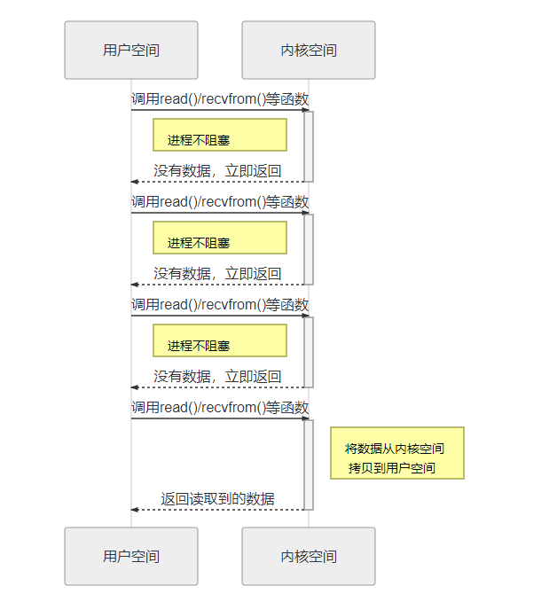

在现代计算机系统中，I/O 操作是影响性能的关键因素，尤其是在网络服务和本地存储密集型应用中。你是否曾经思考过网络 I/O 和本地 I/O 之间的性能差异？为什么网络传输总是比本地硬盘慢？在现代高性能网络编程中，epoll 凭借其卓越的 I/O 多路复用能力，成为了 Linux 环境下处理大规模并发连接的核心工具。那么，epoll 到底为什么如此高效？它如何超越传统的 select() 和 poll()？通过这篇讨论，你将深入了解为什么 epoll 是大规模网络 I/O 管理的首选，以及如何在实践中最大化其优势。

在操作系统中，程序运行的空间分为内核空间和用户空间， 用户空间所有对io操作的代码（如文件的读写、socket的收发等）都会通过系统调用进入内核空间完成实际的操作。
## 阻塞 I/O
在阻塞 I/O 模式下，系统调用（如 read() 或 recvfrom()）会一直等待，直到内核把数据准备好并传输到用户空间。此期间，线程会被挂起，CPU将被释放去做其他事情，但这个线程无法执行任何其他任务，直到 I/O 操作完成。这种情况会导致线程阻塞，尤其在高并发环境下，每个 I/O 操作都可能耗费大量时间等待。在linux中，默认情况下所有的socket都是阻塞的，一个典型的读操作流程大概是这样：

socket_io001
当用户进程调用了 read()/recvfrom() 等系统调用函数，它会进入内核空间中，当这个网络I/O没有数据的时候，内核就要等待数据的到来，而在用户进程这边，整个进程会被阻塞，直到内核空间返回数据。当内核空间的数据准备好了，它就会将数据从内核空间中拷贝到用户空间，此时用户进程才解除阻塞的的状态，重新运行起来。
所以，阻塞I/O的特点就是在IO执行的两个阶段（用户空间与内核空间）都被阻塞了。

## 非阻塞 I/O
非阻塞 I/O 则允许程序发起 I/O 操作（例如 read() 或 recvfrom()），即使数据还没准备好，内核也不会让进程挂起，而是立即返回。此时用户进程得到的是一个错误，提示数据尚未准备好。用户进程需要不断轮询，重复调用 I/O 操作直到数据可用。这种方式避免了线程被阻塞的情况，但频繁的轮询可能会导致 CPU 使用效率低下。
多路复用 I/O
多路复用 I/O (select()，poll()，epoll()) 允许单个线程监控多个文件描述符（如 socket），从而在多个 I/O 操作之间进行复用。它的基本原理是通过轮询多个 socket，查看是否有数据到达，并在有数据到达时通知应用程序。相比非阻塞 I/O，这种机制更高效，特别适合于处理大量连接的服务器。
本地 I/O 操作通常为阻塞模式，即在进行 I/O 操作时，进程会被挂起直到操作完成。然而，现代操作系统也提供了非阻塞本地 I/O 或异步 I/O（如 Linux 的 aio 或 Windows 的 IOCP），允许应用程序继续执行其他任务而不等待 I/O 完成。网络 I/O 同样可以是阻塞的或非阻塞的。在非阻塞网络 I/O 中，进程发起 I/O 操作时不需要等待数据返回，可以继续执行其他操作。网络 I/O 领域中，异步 I/O、多路复用 I/O（如 select()、poll()、epoll()）、以及事件驱动编程（如 libuv、libevent）等技术被广泛使用，以应对高延迟和并发问题。

 
.select() 
用法：允许监视多个文件描述符，以查看它们是否已准备好读取、写入或是否有错误。
限制：
具有可监控的最大文件描述符数量（通常为 1024）。此数量由 定义FD_SETSIZE，在高并发应用程序中可能会受到限制。
当有大量文件描述符时效率低下，因为它每次都必须检查每个描述符。
使用单一数据结构来保存读取、写入和错误描述符。

例子：
fd_set readfds; FD_ZERO(&readfds); FD_SET(socket_fd, &readfds); select(socket_fd + 1, &readfds, NULL, NULL, &timeout); 
2.poll()
用途select()：对文件描述符数量没有限制的改进。
好处：
struct pollfd使用比 使用的位掩码更具可扩展性的数组select()。
可以更轻松地处理大量文件描述符。
缺点：
由于每次调用时都需要轮询列表中的每个文件描述符，因此仍然效率低下。
例子：
struct pollfd fds[2]; fds[0].fd = socket_fd; fds[0].events = POLLIN; poll(fds, 2, timeout); 
## 3. epoll()（Linux 专用）
用途：专为高性能应用程序（例如，处理数千个文件描述符）设计的更具可扩展性和更高效的机制。
好处：
因为它使用基于事件的模型，所以poll()效率更高。select()
内核仅返回已就绪的文件描述符，而不是轮询每个文件描述符。
允许边缘触发和电平触发模式，提供灵活性。
epoll()效率更高，因为它会内部跟踪文件描述符集，并且只在某个文件描述符就绪时通知应用程序。它不需要在每次调用时重新检查所有文件描述符。那为什么epoll可以高效处理数千个连接，达到更好的并发性能？
高效的事件通知机制
select()和poll()：

这两个函数每次调用时都会对所有文件描述符执行线性扫描。这意味着即使只有少数文件描述符“就绪”（即数据可供读取/写入），内核也必须在每次调用该函数时检查每个描述符。这使得它们的性能与受监视的文件描述符数量成正比。
例如，如果您正在监视 1,000 个文件描述符，但只有 1 个已准备就绪，select()则poll()仍将对所有 1,000 个进行迭代。

epoll()：

epoll它的工作原理是只向内核注册一次文件描述符（使用epoll_ctl()）。此后，内核会跟踪哪些文件描述符已就绪。当您调用时epoll_wait()，它仅返回具有事件（即数据就绪）的文件描述符，而不会扫描所有文件描述符。这使得它更加高效，尤其是在监视大量描述符时，因为它消除了重复扫描的需要。
它不再在每次调用时检查所有文件描述符，epoll而是更像一个“事件驱动”系统：当注册描述符的状态发生变化时，内核会通知您。

2.边沿触发和电平触发模式
epoll()提供两种模式：LT（level trigger）和ET（edge trigger）。
边缘触发：当文件描述符的状态发生变化时（例如，当数据可用时），应用程序只会收到一次通知。然后应用程序负责读取/写入所有可用数据。这最大限度地减少了系统调用，因为应用程序不需要不断轮询内核。
水平触发：行为更像poll()或select()；只要文件描述符保持就绪状态，它就会不断通知应用程序。这提供了灵活性，但边缘触发模式可以显著减少高性能应用程序中的开销。
3.大量描述符的 O(1) 性能
select()和poll()：
两者都具有O(n)复杂度，其中n是被监视的文件描述符的数量。随着描述符数量的增加，检查它们所花费的时间也呈线性增长。
epoll()：
epoll_wait()对于大多数操作来说，其复杂度为O(1)，这意味着它的性能不会随着文件描述符数量的增加而降低。这使得它在处理数千（甚至数万）个连接时具有更好的扩展性。
4.内核空间数据结构
epoll()使用更先进的内核空间数据结构（如红黑树和链接列表）来高效跟踪文件描述符。一旦文件描述符被注册，它就会存储在树中，从而允许快速查找和更新，进一步提高性能。
相比之下，每次调用时select()都poll()需要将所有文件描述符从用户空间复制到内核空间，并且内核必须检查每一个文件描述符，从而导致更多的开销。
5.大量描述符的内存使用率较低
在 中select()，您必须提供一个固定大小的位掩码（通常限制为 1024 个描述符，但在某些系统中可以进行调整）。
在中poll()，您传递一个数组struct pollfd，该数组随着描述符的数量线性增长。
epoll()通过仅维护活动文件描述符（具有事件的文件描述符）列表而不是所有描述符的完整集合来最大限度地减少内存使用量。
下面是epoll性能检测的一段代码示例：

#include <stdio.h>
#include <sys/epoll.h>
#include <unistd.h>
#include <fcntl.h>

int main() {
    int fd1 = open("file1.txt", O_RDONLY);
    int fd2 = open("file2.txt", O_RDONLY);

    if (fd1 < 0 || fd2 < 0) {
        perror("open failed");
        return -1;
    }

    // Create an epoll instance
    int epoll_fd = epoll_create1(0);
    if (epoll_fd < 0) {
        perror("epoll_create1 failed");
        return -1;
    }

    // Add fd1 and fd2 to the epoll instance
    struct epoll_event event;
    event.events = EPOLLIN;  // We are interested in read events

    event.data.fd = fd1;
    if (epoll_ctl(epoll_fd, EPOLL_CTL_ADD, fd1, &event) < 0) {
        perror("epoll_ctl failed for fd1");
        return -1;
    }

    event.data.fd = fd2;
    if (epoll_ctl(epoll_fd, EPOLL_CTL_ADD, fd2, &event) < 0) {
        perror("epoll_ctl failed for fd2");
        return -1;
    }

    struct epoll_event events[2];

    while (1) {
        // Wait for events on the file descriptors
        int num_events = epoll_wait(epoll_fd, events, 2, -1);

        if (num_events < 0) {
            perror("epoll_wait failed");
            break;
        }

        // Handle the events that are ready
        for (int i = 0; i < num_events; i++) {
            if (events[i].data.fd == fd1) {
                printf("Data ready on fd1\n");
            } else if (events[i].data.fd == fd2) {
                printf("Data ready on fd2\n");
            }
        }
    }

    close(fd1);
    close(fd2);
    close(epoll_fd);
    return 0;
}

 

epoll()速度更快，主要是因为它避免了重复扫描所有文件描述符，而是使用事件驱动模型，仅在必要时通知应用程序。对于大多数操作，它的性能为 O(1)，并且可以高效处理数千个连接，使其成为大型 Web 服务器等高并发场景的理想选择。相比之下，select()和poll()两者都具有 O(n) 性能，随着文件描述符数量的增加，这会导致速度明显变慢。