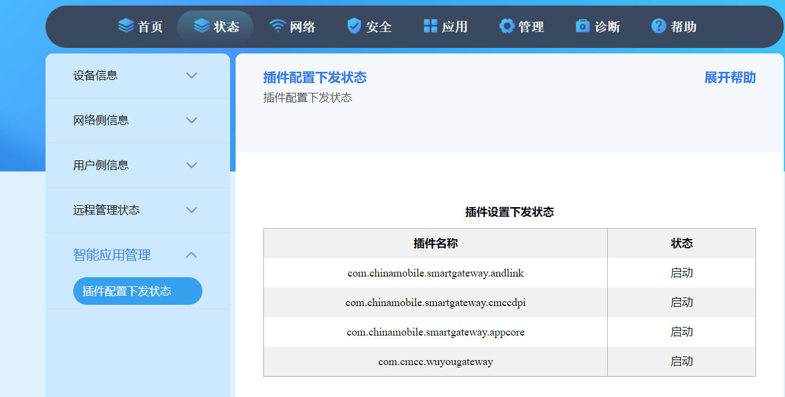

前几年受“提速降费”政策影响，国内高速宽带发展非常快。然而此一时彼一时，“互联网经济”这个话题落幕，运营商开始重新圈地。“打击 PCDN ”似乎就是吹响运营商利益至上的号角。

按照惯例，政策执行后续都会扩大化。说是禁 PCDN ，目前已经有扩大化迹象，比如顺带被封禁的 PT 和 NAS 服务。这两个服务同样容易产生较大网络流量，所以容易被误伤。不过事情还不仅如此。网络监控会进一步收紧，运营商会全面监控网络流量，这种监控是否进一步扩大化不详。

最近，不少网友反映，家里的宽带网关似乎变得“不太安分”了。以中国移动为例，后台进程里多了几个不认识的应用，比如 com.chinamobile.smartgateway.andlink、com.chinamobile.smartgateway.cmccdpi、com.chinamobile.smartgateway.appcore 和 com.cmcc.wuyougateway。这些应用是什么？它们在干什么？运营商为什么要这么做？今天我们就来聊聊这个话题。
中国移动在为用户安装宽带时，总会好心地“赠送”一个光猫(调制解调器)。这看似是个不错的促销手段，但通常情况下，这个“赠品”会给用户带来许多麻烦。

赠送的“光猫”安装了许多不必要的功能。光猫的本职工作是进行光电转换，然而中国移动的“光猫”不仅承担着光电转换的任务，还同时进行拨号上网、路由、地址转换(NAT)、端口映射、文件服务器(FTP)等等额外的功能。这些功能让本就廉价而算力低下的光猫运行缓慢，不堪重负。最可气的是，中国移动为了节约维护成本，将光猫的绝大多数设置项锁定，防止用户修改。

用户想要拿到光猫的控制权，这是一个很常见的需求，尤其是在对网络有一定了解和个性化需求的用户群体中。然而，由于运营商出于网络稳定、业务安全和管理便捷等方面的考虑，往往会对光猫进行限制，用户很难完全掌控自己的设备。为了重新“拥有”光猫，我决定夺回对光猫的控制权。

**“神秘”的应用们：功能与争议**

2019年10月28日，有人在 Pastebin 公开了一份华为路由器的某个配置文件， 其中就有 com.chinamobile.smartgateway.cmccdpi 插件。

2022 年8月，多个技术论坛（如知乎、贴吧、恩山无线论坛等）开始涌现用户对中国移动宽带服务的投诉和技术讨论。一些用户尝试通过第三方手段获取超级管理员权限（如解密密码、破解光猫固件）。另一些用户干脆自购路由器，尝试完全绕过光猫的管理干预。
用户发现通过 4in6 隧道接入的家庭网络通常会叠加多层 NAT，导致端口映射功能受限，无法高效实现公网通信。用户发现移动宽带在 IPv6 网络部署中引入了 4in6 隧道技术，通过将 IPv4 流量封装到 IPv6 中传输。删除 TR-069 是否有效？
TR-069 协议是宽带运营商常用的远程管理工具，但部分用户指出，即使禁用该协议，光猫依然接受远程指令，表明可能存在其他未知远程管理机制。
超级密码的再下发：
用户多次修改光猫管理员密码后，运营商会周期性地通过远程下发随机生成的超级密码覆盖原密码，这让用户感到隐私受侵。

2023年4月23日，谷子猫发布了博文，表示移动的光猫含有一些特殊插件，分别是：

com.cmcc.wuyougateway
com.chinamobile.smartgateway.andlink
com.chinamobile.smartgateway.cmccdpi
com.chinamobile.smartgateway.appcore
它们似乎被称为「软探针」，能够生成给用户观看的「家庭网络使用概览」，其中含有社交、游戏、视频等应用类型的流量占比， 并且还有「网络安全防护情况」，能为用户检测安全风险，比如「检测不良内容网站」。当使用桥接，通过路由器上网后， 上述功能就会失效。

所以 …cmccdpi 插件最后的 dpi，应该就是指深度包检测（DPI），或许还有 DNS 请求记录之类的功能。有这样的功能， 才能起到提供信息以及保护用户的作用。但是这些数据除了呈现给用户，是否还分享给第三方，暂不可知。

**TR069：运营商的“远程控制”**

这些应用是如何被安装到你的网关里的呢？答案就是 TR069。

TR069 是一种标准化的远程管理协议，允许运营商远程配置和管理用户家中的网关设备。通过 TR069，运营商可以下发配置、更新固件、诊断故障，当然也可以安装和启动应用。

TR069 的存在，让运营商可以更高效地管理大规模的网络设备，及时修复漏洞、推送更新，保障网络稳定运行。但同时，也赋予了运营商极大的控制权，用户在某种程度上失去了对自己网关的掌控。

# **PCDN 大潮下的运营商考量**

这一切的背后，是 PCN（Peer Content Network，对等内容网络）和 CDN（Content Delivery Network，内容分发网络）技术的发展和普及。

随着互联网流量的爆炸式增长，传统的中心化内容分发模式已经难以满足需求。中国多地互联网服务提供商（ISP）对基于PCDN（个人云分布式网络）的相关业务采取了严厉措施，包括限速、封停宽带、甚至要求用户签署保证书恢复部分网络服务。这种强制性政策主要出于以下几点考量：

网络负担与成本问题：PCDN通过利用家庭宽带的上行带宽分发内容，可能导致网络拥堵，特别是在上行带宽较小的小区网络中，还会加大运营商在骨干网扩容和运维方面的成本​
商业竞争与监管合规性：运营商的核心收入来源之一是提供CDN（内容分发网络）服务，而PCDN的广泛使用可能蚕食这一市场。此外，根据中国工信部的相关规定，未取得经营许可证的个人或企业不得提供CDN服务，因此个人通过PCDN设备牟利被视为违法
短视频博主“影视飓风”引发了一场关于视频画质的热议。他在微博上透露，由于多种原因，其与视频清晰度相关的内容被要求在全网下架。这起事件迅速吸引了大量关注，引发了人们对视频平台画质压缩策略的讨论。

影视飓风此前发布了一则科普视频《清晰度不如4年前！视频变糊是你的错觉吗？》，指出一些视频平台为了降低流量成本，采用降低码率和改变编码格式等措施。这种动态调节码率的做法在视频热门时尤为常见，目的是节省带宽，但这可能导致画质下降

此外，DPI 技术在 PCN/CDN 架构中也扮演着重要角色。通过分析网络流量，运营商可以更精准地进行内容调度和缓存，提升 PCN/CDN 的效率。同时，DPI 也可以用于识别和过滤非法内容，保障网络安全。

# **如何摆脱控制**
改光猫桥接，最麻烦的就是超密的获取。
一些省份或者运营商，是网络上可查的通用帐号密码。这就比较好办
还有一些地方，超密是自动下发的，甚至会定期自动更改。这就很麻烦。
而且运营商非常与时俱进，很多网络上容易获取的办法，他们都已经想办法屏蔽掉了。因此，即便是同运营商同型号设备，或许网络上找到的办法，也未必能在你的手里成功。

总得来说就是获取超级密码、开telnet、改桥接、改地区、禁用TR069。注意 用户需要具备一定的技术知识和技能，才能正确地配置和管理光猫。

**用户：知情权与选择权**

然而，在运营商追求效率和商业利益的同时，用户的知情权和选择权也应该得到尊重。

运营商应该向用户清晰地说明智能网关应用的功能、作用以及数据使用方式，获得用户的明确授权。用户应该有权选择是否启用这些功能，并有权卸载或禁用不需要的应用。

此外，运营商也应该加强安全防护，保护用户数据安全，防止隐私泄露。只有在用户信任的基础上，运营商的这些举措才能真正发挥作用，实现用户、运营商和整个互联网生态的多赢。